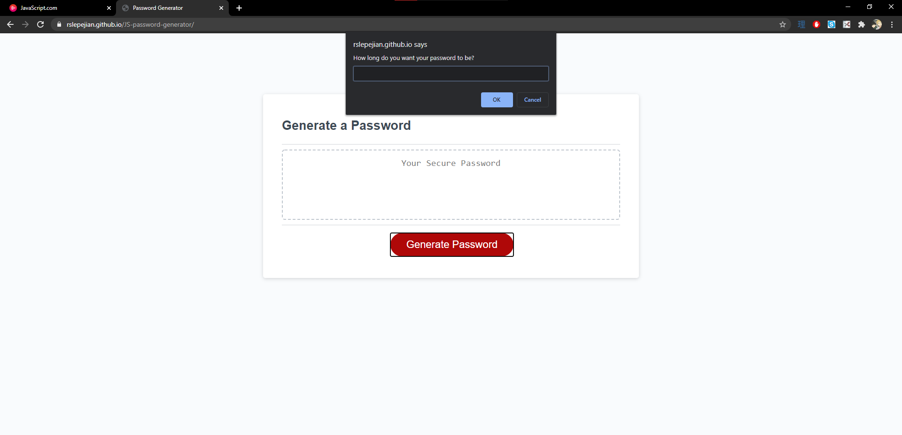
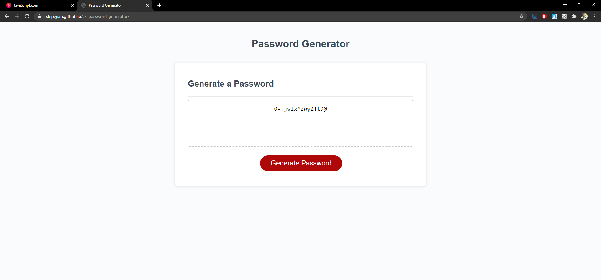

# Javascript Password Generator

## Description

This project entailed writing a javascript function for a website with premade html and css that generates a password of random characters based on several specifications made by the user. These specifications are: the length of the password (8-128 characters), whether to include lowercase letters, whether to include uppercase letters, whether to include numbers, and whether to include special characters. 

## Built With

* [HTML](https://developer.mozilla.org/en-US/docs/Web/HTML)
* [CSS](https://developer.mozilla.org/en-US/docs/Web/CSS)
* [Git]
* [Github](https://github.com/)
* [Javascript](https://www.javascript.com/)

## Deployed Link

* [See Live Site](https://rslepejian.github.io/JS-password-generator/)

## Preview of Working Site




## Code Snippet
These two code snippets were chosen because they show the process of appending the decimal values of ascii special characters to an array containing all decimal values for characters allowed in the password as specified by the user. These code snippets demonstrate some of the logic that went into generating a random string with predefined possibilities for characters, and this presented the main problem of this project.

```javascript
var special = confirm("Select ok to confirm special characters");
```

```javascript
// adds ascii decimal values of special characters to asciivals array (including space)
// several for loops are needed because special character decimal values are not all adjacent
// to disinclude space change  the 32 in the first for loop to 33
if (special){
          for (i = 32; i < 48; i ++){
              asciivals.push(i);
          }
          for (i = 58; i < 65; i ++){
              asciivals.push(i);
          }
          for (i = 91; i < 97; i ++){
              asciivals.push(i);
          }
          for (i = 122; i < 127; i ++){
              asciivals.push(i);
          }
      }
  
```

## Authors

* **Raffi Lepejian** 

## Contact Information

- [Link to Portfolio Site](#)
- [Link to Github](https://github.com/rslepejian)
- [Link to LinkedIn](https://linkedin.com/in/raffi-lepejian-071876153)